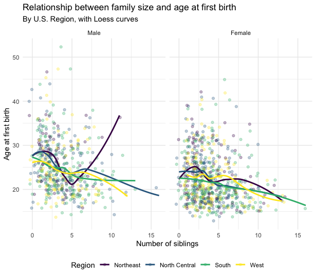

```{r setup, include = FALSE}
knitr::opts_chunk$set(
  error = TRUE,
  collapse = TRUE,
  message = FALSE, 
  warning = FALSE,
  comment = "#> ",
  class.output = "output",
  class.message = "message",
  class.error = "message"
)
```

# Figures

## Prepare {-}

Then you'll need to load the `tidyverse` package and read in the data. In lab we read it in from a url, this time I gave you the data in the zipped folder. The funciton to read it in is the same:

```{r}
library(tidyverse)
nlsy <- read_csv("nlsy_cc.csv")
```

## Intro to `ggplot2`

### Make a scatterplot {-}

Make a scatter plot of the relationship between hours of sleep on weekends and weekdays. Color it according to region (where 1 = northeast, 2 = north central, 3 = south, and 4 = west). Use the code from the example below to get started!

```{r}
ggplot(data = nlsy) +
  geom_point(aes(x = income, y = age_bir, color = factor(eyesight))) +
  scale_color_brewer(palette = "Set1", name = "Eyesight",
                     labels = c("Excellent", "Very Good", "Good",
                                "Fair", "Poor"))
```

<!-- If you are using the RMarkdown document, you can write your answers in the empty chunk below -->
<!-- Also, this is how you write a comment in the text sections of an R Markdown document! You can use the same keyboard shortcut we learned last week for R code. -->
```{r}

```

### Jittering {-}

Using your plot from the previous question, replace `geom_point()` with `geom_jitter()`. What does this do? Why might this be a good choice for this graph? Play with the `width = ` and `height = ` options within `geom_jitter()`. This site may help: https://ggplot2.tidyverse.org/reference/geom_jitter.html

```{r}

```

### Shapes {-}

Use the `shape = ` argument to map the sex variable to different shapes. Change the shapes to squares and diamonds. (Hint: how did we manually change colors to certain values? This page might also help:
https://ggplot2.tidyverse.org/articles/ggplot2-specs.html)

```{r}

```

### Explore! {-}

Using a structure like this, you can explore changing what's in the `<>`. 

- Use either the resources in the slides (now also on the resources page), or just start typing e.g., `geom_` or `scale_color` and choose one of the autocompletes.
- Depending on what you choose, different arguments might be required/allowed. For example, `geom_point()` requires both `x = ` and `y = `, but `geom_histogram()` only `x = `. You can use `help(geom_point)` for guidance, under the "Aesthetics" section.
- What happens if you include `color = ` both within and outside of the `aes()` argument? What happens if you use an actual color, like `"blue"` inside? Or a variable name outside?
- It might be helpful for you to keep a script with all the different things you try, with a comment about whether or not it worked and what you did.
<!-- If you are using the RMarkdown document, the `eval = FALSE` in the chunk below is me telling R not to run this section when I knit it, since I don't want that plot to show up again. -->
<!-- If you want to knit this page, instead of just running it chunk-by-chunk, change the eval = FALSE to eval = TRUE, or delete everything besides the r entirely. -->
```{r, eval = FALSE}
ggplot(data = nlsy) +
  geom_<>(aes(x = <>, y = <>, color = <>, ...), color = <>, ...) +
  scale_color_<>(name = <>, ...)
```

## Facets

First we made a graph faceted by columns. Then we switched to rows. Try that out with this code. Try out another variable to facet by, instead of region. What if we facet by both columns and rows? You can also play around with the `margins = ` and the `scales = ` arguments. Use `help(facet_grid)` to find out more.

```{r}
ggplot(data = nlsy) +
  geom_bar(aes(x = nsibs)) +
  labs(x = "Number of siblings") +
  facet_grid(cols = vars(region), margins = TRUE, scales = "free_y")
```

We also saw that we could (maybe) make better use of space with `facet_wrap()`. Try changing the variable we're facetting by (`region`), and the `ncol = ` argument. Alternatively, you can specify the number of rows with `nrow = `.
```{r}
ggplot(data = nlsy) +
  geom_bar(aes(x = nsibs)) +
  labs(x = "Number of siblings") +
  facet_wrap(vars(region),
             ncol = 3)
```

We also learned to make a histogram, with a bin for every $1,000 of income. Try out some different `binwidth = ` or `bins = ` argument. Or leave it out and see the warning you get!

```{r}
ggplot(data = nlsy) +
  geom_histogram(aes(x = income), binwidth = 1000)
```

### Density histograms {-}

When we're comparing distributions with very different numbers of
observations, instead of scaling the y-axis like we did with the
`facet_grid()` function, we might want to make *density* histograms, where instead of the count of observations along the y-axis, we have the density (i.e., the histogram is scaled so that its entire area adds up to 1). Use google to figure out how to make a *density* histogram of income. Facet it by region.

```{r}

```

### Color your histograms {-}
Make each of the regions in your previous histogram a different color. (Hint: compare what `col = ` and `fill = ` do to histograms).

```{r}

```

### `scale_x_...` {-}

Instead of a log-transformed x-axis, make a square-root transformed x-axis. See what other options for the x-axis you have, using the autocomplete in RStudio.

```{r}

```

### Label your x-axis {-}

Doing the last part squishes the labels on the x-axis. Using the `breaks = ` argument that all the `scale_x_...()` functions have, make labels at 1000, 10000, 25000, and 50000.

```{r}

```

## Saving your work

Here's a plot to start you off. Look through each line and make sure you understand what it's doing.

```{r}
ggplot(data = nlsy) +
  geom_boxplot(aes(x = factor(sleep_wknd), y = sleep_wkdy,
                   fill = factor(sleep_wknd))) +
  scale_fill_discrete(guide = FALSE) +
  labs(x = "hours slept on weekends",
       y = "hours slept on weekends",
       title = "The more people sleep on weekends, 
       the more they sleep on weekdays",
       subtitle = "According to NLSY data") +
  theme_classic()
```

### Using `ggsave()` {-}

Using the plot above as guidance, change at least 3 elements, if not more! Then save it using the code below. These are probably not the right dimensions for your plot, so experiment! You can also change from pdf to e.g., png by changing the file name. Look in the files pane to see where your saved plot shows up.

```{r, eval = FALSE}
ggplot()

ggsave(filename = "my_plot.pdf", height = 8, width = 4)
```

### Storing your plot as an object {-}

That function will automatically save the last plot you made. If you're making lots of plots, you should store them and refer to them by name. Try that with a new plot here. Notice what happens in the plots pane, and in the environment pane, when you do so.
```{r, eval = FALSE}
new_plot <- ggplot()

ggsave(plot = new_plot, filename = "another_plot.png")
```

### Challenge: Recreate the plot from the slides {-}

This will definitely require some Googling (reminder: I have to Google something for almost every plot I make!) so is a challenge! See how close you can get. We'll also be working on this in lab, so don't worry if you don't get very far!

<!-- You can open this plot, family_age_bir.png, directly in this week's materials -->
```{r, echo = FALSE}

```
