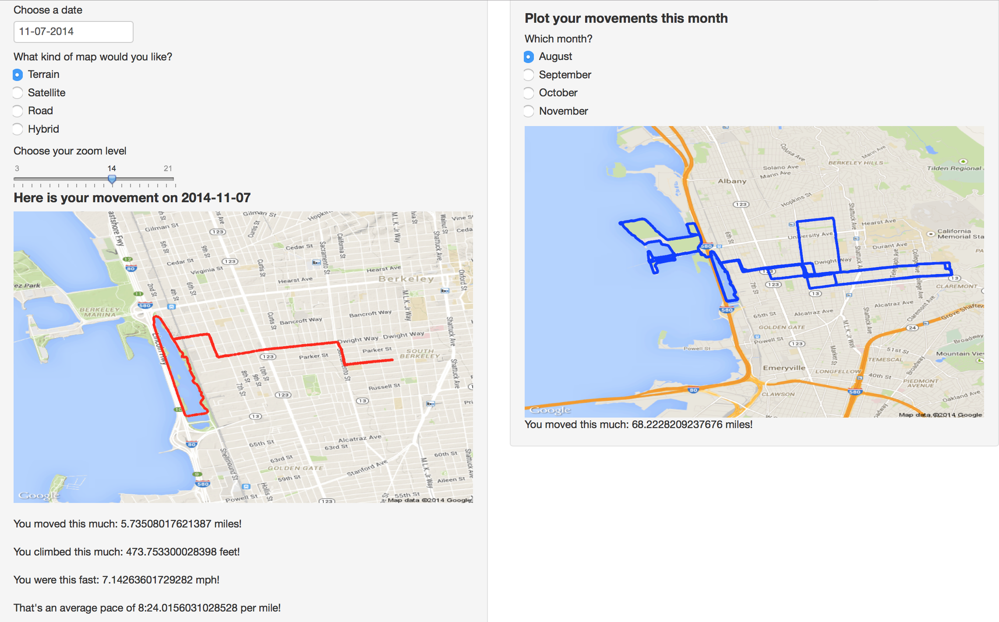
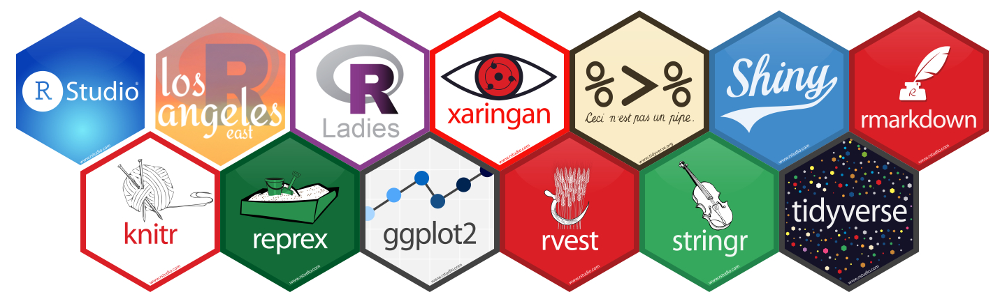
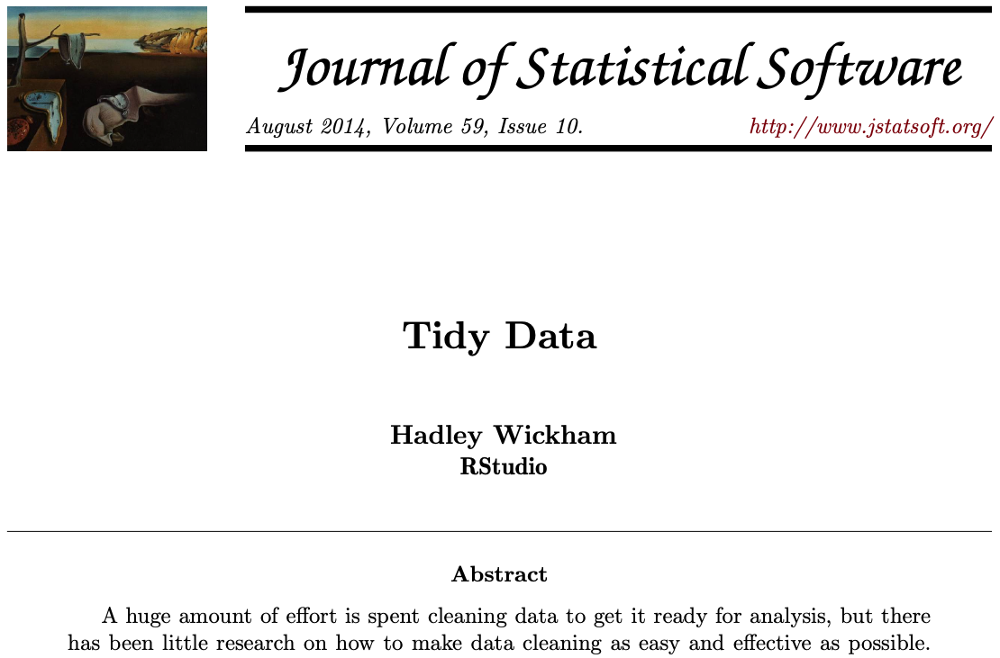

class: inverse, center, middle
```{css webcam-spot, echo = FALSE, eval = FALSE}
.webcam-wrapper{
  width: 175px;
  height: 90px;
  float: right;
}
```
```{r setup, include=FALSE}
options(htmltools.dir.version = FALSE, width = 93)

knitr::opts_chunk$set(
  # fig.dim = c(4.8, 4.5), 
                      fig.align = "center", 
                      fig.retina = 3, 
                      message = FALSE, 
                      warning = FALSE, 
                      cache = TRUE)

knitr::opts_hooks$set(fig.callout = function(options) {
  if (options$fig.callout) {
    options$echo <- FALSE
    options$out.height <- "99%"
    options$fig.width <- 16
    options$fig.height <- 8
  }
  options
})

# use, where 3 is the link of goals-plot-2 chunk to add:
# .left-code[
#  ```{r goals-plot-2c, fig.show="hide", code=reveal("goals-plot-2", 3)}
# ```
# ]
# .right-plot[
# `)
# ]
reveal <- function(name, num) {
  content <- knitr:::knit_code$get(name)
  last_line <- which(stringr::str_detect(content, "\\+"))[num]
  if (is.na(last_line)) last_line <- length(content)
  if (num == 1) {
    first_line <- 1
    } else {
    first_line <- which(stringr::str_detect(content, "\\+"))[num - 1] + 1
    }
  content[last_line] <- stringr::str_remove(content[last_line], "\\+")
  new_lines <- paste0(content[first_line:last_line], " #<<")
  orig_lines <- if (num == 1) 0 else 1:(first_line - 1)
  c(content[orig_lines], new_lines)
}


# for use when highlighting some parts of code 
# with backticks so that it doesn't run
# include another code block with chunk option 
# code = repeat_code("first-chunk-name")
repeat_code <- function(name) {
  content <- knitr:::knit_code$get(name)
  str_remove_all(content, "`")
}

library(tidyverse)
```
.hand-large[
Let's start with...
]
.larger[
The basics
]

---
# About this class


- Non-credit

- 6 weeks

- Watch the videos and do the exercises on your own (or with friends/classmates), come together for lab

- Practice by yourself in between classes

- Everything you need is at http://intro-to-r-2020.louisahsmith.com

.go[
You are not going to break anything!
]


---
# About me

.pull-left[
- Rising 5th-year PhD candidate in Epidemiology

- Started using R during my master's (so 6 years of experience); learned mostly by doing

- Problem sets, manuscripts, slides, website all in R

- Almost 100 R projects on my computer, over 1000 R scripts

]
.pull-right[

]

--
.bottom[
.go[
I have to Google things literally every time I use R!
]
]

---
# Plan

## **Week 1: The basics**

## **Week 2: Figures**

## **Week 3: Selecting, filtering, and mutating**

## **Week 4: Grouping and tables**

## **Week 5: Functions**

## **Week 6: Analyze your data**

---

.pull-left[


]
.pull-right[.middle[

# An IDE for R

An *integrated development environment* is software that makes coding easier

- see objects you've imported and created
- autocomplete
- syntax highlighting
- run part or all of your code


]

<br>
<br>
<br>
.right[
.demo[Setup...]]
]


---
class: inverse

.pull-left[
.huge-number[
1
]
]
.pull-right[
.hand-large[
Your turn...
]
.exercise[
- Install R
- Install R Studio
]
]


---
class:middle inverse center
name:rstudio-intro
background-image: url(../img/rstudio.png)
background-size: contain

---
count: false
class:middle inverse center
background-image: url(../img/rstudio-markup.png)
background-size: contain

---
# Packages

- Some functions are built into R
  - `mean()`, `lm()`, `table()`, etc.
- They actually come from built-in packages
  - `base`, `stats`, `graphics`, etc.
- Anyone (yes, *anyone*) build their own package to add to the functionality of R
  - `ggplot2`, `dplyr`, `data.table`, `survival`, etc.

.center[]

.footnote[
Image from [Zhi Yang](https://zhiyang.netlify.app/post/hexwall/)
]

---
# Packages

.large[
- You have to **install** a package once*

```r
install.packages("survival")
```

- You then have to **load** the package every time you want to use it

```r
library(survival)
```
]
.footnote[*Actually, with every new major R release, but we won't worry about that.]

---
# Packages


"You only have to buy the book once, but you have to go get it out of the bookshelf every time you want to read it."

```r
install.packages("survival")
library(survival)
survfit(...)
```

.center[.hand[Several days later...]]

```r
library(survival)
coxph(...)
```

.pull-right-narrow[
.demo[Demonstration...]
]

---
# Package details


- When you use `install.packages`, packages are downloaded from [CRAN](https://cran.r-project.org) (The Comprehensive R Archive Network)
  - This is also where you downloaded R
- Packages can be hosted lots of other places, such as [Bioconductor](https://www.bioconductor.org) (for bioinformatics), and [Github](https://www.github.com) (for personal projects or while still developing)
- The folks at CRAN check to make things "work" in some sense, but don't check on the statistical methods...
  - But because R is open-source, you can always read the code yourself
- Two functions from different packages can have the same name... if you load them both, you may have some trouble


---
# tidyverse

- The same people who make RStudio also are responsible for a set of packages called the `tidyverse`



---
# tidyverse

.large[
.pull-left-wide[
- Running `install.packages(tidyverse)` actually downloads more than a dozen packages*
- Running `library(tidyverse)` loads:
.center[`ggplot2`, `dplyr`, `tidyr`, `readr`, `purrr`, `tibble`, `stringr`, `forcats`]
- This is by no means the only way to manage your data, but I find that a lot of the time, it's the easiest and simplest way to get things done.
]
]

.pull-right-narrow[

]

.footnote[*See which ones at [https://tidyverse.tidyverse.org](https://tidyverse.tidyverse.org)]

---
class: inverse

.pull-left[
.huge-number[
2
]
]
.pull-right[
.hand-large[
Your turn...
]
.exercise[
- Install the `tidyverse` "package"
- Load *one* of the `tidyverse` packages
]
]

---
name: r-projects
# R projects

.pull-left-narrow[
```
my-project/
 ├─ my-project.Rproj
 ├─ README
 ├─ data/
 │   ├── raw/
 │   └── processed/
 ├─ code/
 ├─ results/
 │   ├── tables/
 │   ├── figures/
 │   └── output/
 └─ docs/
```
]
.pull-right-wide[
- An `.Rproj` file is mostly just a placeholder. It remembers various options, and makes it easy to open a new RStudio session that starts up in the correct working directory. You never need to edit it directly.

- A README file can just be a text file that includes notes for yourself or future users.

- I like to have a folder for raw data -- which I never touch -- and a folder(s) for datasets that I create along the way.
]

---

# This course

.pull-left-narrow[
```
R-course/
 ├─ 01-week/
 │   ├── 01-week.Rproj
 │   ├── 01-exercises.R
 │   ├── 01-lab.Rmd
 │   ├── 01-slides.pdf
 │   └── data/
 │        └── nlsy.csv 
 ├─ 02-week/
 │   ├── 02-week.Rproj
 │   ├── 02-exercises.R
 │   ├── 02-lab.Rmd
 │   ├── 02-slides.pdf
 │   └── data/
 │        └── nhanes.xlsx 
 ├── 03-week/
```
]
.pull-right-wide[

- Each week you'll download a zip file of some or all of the things you need for the week
  - You may be adding more later!
- Open the week's work by opening the `.Rproj` file
  - This will ensure you're in the right working directory to easily access the data, etc.
  <br>
  <br>
  <br>
  <br>
  <br>
.right[
.demo[Demonstration...]
]
]


---
class: inverse

.pull-left[
.huge-number[
3
]
]
.pull-right[
.hand-large[
Your turn...
]
.exercise[
- Download the `01-week.zip` file [here](http://intro-to-r-2020.louisahsmith.com/exercises/01-week.zip)
- Open up the `01-week.Rproj` file
]
]


---
name: using-R

# R uses `<-` for assignment
.midi[
Create an object `vals` that contains and sequence of numbers:

```{r}
# create values
vals <- c(1, 645, 329)
```

Put your cursor at the end of the line and hit ctrl/cmd + enter.

Now `vals` holds those values.

We can see them again by running just the name (put your cursor after the name and press ctrl/cmd + enter again).

```{r}
vals
```

.go[No assignment arrow means that the object will be printed to the console.]
]

---
# Types of data (*classes*)
.midi[
We could also create a character *vector*:

```{r}
chars <- c("dog", "cat", "rhino")
chars
```

Or a *logical* vector:

```{r}
logs <- c(TRUE, FALSE, FALSE)
logs
```

.go[We'll see more options as we go along!]
]

---

# Types of objects
.midi[
We created *vectors* with the `c()` function (`c` stands for concatenate)

We could also create a *matrix* of values with the `matrix()` function:
```{r}
# turn the vector of numbers into a 2-row matrix
mat <- matrix(c(234, 7456, 12, 654, 183, 753), nrow = 2)
mat
```

The numbers in square brackets are *indices*, which we can use to pull out values:

```{r}
# extract second row
mat[2, ]
```
]

---
# Dataframes

We usually do analysis in R with dataframes (or some variant).

Dataframes are basically like spreadsheets: columns are variables, and rows are observations.
```{r}
gss_cat
```

---
background-image: url(https://ih1.redbubble.net/image.543363717.2207/pp,840x830-pad,1000x1000,f8f8f8.jpg)
background-size:contain

# *tibble*???

---
# tibbles are basically just pretty dataframes

.pull-left[
```{r, comment = NA}
as_tibble(gss_cat)[, 1:4]
```
]

.pull-right[
```{r, comment = NA, eval = FALSE}
as.data.frame(gss_cat)[, 1:4]
```
```{r, comment = NA, echo = FALSE}
as.data.frame(gss_cat)[1:20, 1:4]
```
]

---

# and tibbles are the quickest and most intuitive way to make and read a dataset
.pull-left[
```{r}
dat1 <- tibble(
  age = c(24, 76, 38),
  height_in = c(70, 64, 68),
  height_cm = height_in * 2.54
)
dat1
```
]
.pull-right[
```{r}
dat2 <- tribble(
  ~n, ~food, ~animal,
  39, "banana", "monkey",
  21, "milk", "cat",
  18, "bone", "dog"
)
dat2
```
]

---
class: inverse

.pull-left[
.huge-number[
4
]
]
.pull-right[
.hand-large[
Your turn...
]
.exercise[
- Work through the code in `01-week/01-todo.R`
]
]
