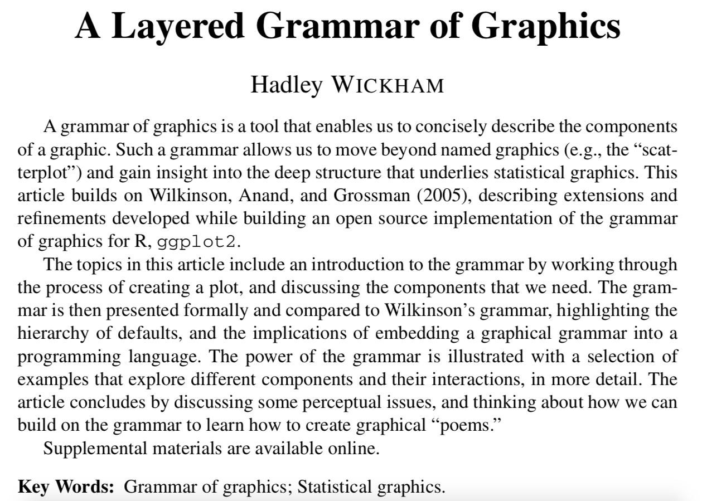
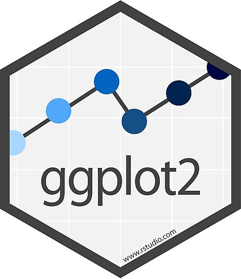

class: inverse, center, middle
```{css webcam-spot, echo = FALSE, eval = FALSE}
.webcam-wrapper{
  width: 175px;
  height: 90px;
  float: right;
}
```
```{r setup, include=FALSE}
options(htmltools.dir.version = FALSE, width = 93)

knitr::opts_chunk$set(tidy = FALSE,
                      fig.align = "center", 
                      fig.retina = 3, 
                      message = FALSE, 
                      warning = FALSE, 
                      cache = TRUE)

knitr::opts_hooks$set(fig.callout = function(options) {
  if (options$fig.callout) {
    options$echo <- FALSE
    options$out.height <- "99%"
    options$fig.width <- 16
    options$fig.height <- 8
  }
  options
})

# use, where 3 is the link of goals-plot-2 chunk to add:
# .left-code[
#  ```{r goals-plot-2c, fig.show="hide", code=reveal("goals-plot-2", 3)}
# ```
# ]
# .right-plot[
# `)
# ]
reveal <- function(name, num) {
  content <- knitr:::knit_code$get(name)
  last_line <- which(stringr::str_detect(content, "\\+"))[num]
  if (is.na(last_line)) last_line <- length(content)
  if (num == 1) {
    first_line <- 1
    } else {
    first_line <- which(stringr::str_detect(content, "\\+"))[num - 1] + 1
    }
  content[last_line] <- stringr::str_remove(content[last_line], "\\+")
  new_lines <- paste0(content[first_line:last_line], " #<<")
  orig_lines <- if (num == 1) 0 else 1:(first_line - 1)
  c(content[orig_lines], new_lines)
}


# for use when highlighting some parts of code 
# with backticks so that it doesn't run
# include another code block with chunk option 
# code = repeat_code("first-chunk-name")
repeat_code <- function(name) {
  content <- knitr:::knit_code$get(name)
  str_remove_all(content, "`")
}

library(tidyverse)
```


```{r data, include = FALSE}
nlsy <- read_csv(here::here("static", "data", "nlsy.csv")) %>%
  mutate_all(~ifelse(.<= -998 | between(., -6, -1), NA, .)) %>%
  na.omit()

colnames(nlsy) <- c("glasses", "eyesight", "sleep_wkdy", "sleep_wknd",
                    "id", "nsibs", "samp", "race_eth", "sex", "region", 
                    "income", "res_1980", "res_2002", "age_bir")
```

.hand-large[
Let's make our data...
]
.larger[
beautiful
]

---
# #goals
.pull-left[
```{r goals-plot-1, echo = FALSE, warning = FALSE, out.width="500px", out.height = "500px", fig.align = "center"}
ggplot(data = nlsy) +
  geom_bar(aes(x = eyesight, 
          fill = factor(eyesight))) +
  facet_grid(
    cols = vars(glasses),
    labeller = labeller(glasses = c(
      "0" = "Doesn't wear glasses",
      "1" = "Wears glasses/contacts"))) +
  scale_fill_brewer(palette = "Spectral",
                    direction = -1) +
  scale_x_continuous(
    labels = c("Excellent", "Very Good",
               "Good", "Fair", "Poor"),
    breaks = c(1, 2, 3, 4, 5)) +
  theme_minimal() +
  theme(legend.position = "none",
        axis.text.x = element_text(
      angle = 45, vjust = 1, hjust = 1)
    ) +
  labs(title = "Eyesight in NLSY",
       x = "Eyesight quality",
       y = NULL) +
  coord_cartesian(expand = FALSE)
```
]
.pull-right[

```{r goals-plot-2, echo = FALSE, warning = FALSE, out.width="500px", out.height = "500px", fig.align = "center"}
ggplot(data = nlsy, aes(x = income, 
    y = age_bir, col = factor(sex))
) +
  geom_point(alpha = 0.1) +
  scale_color_brewer(palette = "Set1",
    name = "Sex",
    labels = c("Male", "Female")) +
  scale_x_log10(labels = 
                  scales::dollar) +
  geom_smooth(aes(
    group = factor(sex)), 
    method = "lm") +
  facet_grid(rows = vars(race_eth),
    labeller = labeller(race_eth = c(
    "1" = "Hispanic",
    "2" = "Black",
    "3" = "Non-Black, Non-Hispanic"))) +
  theme_minimal() +
  theme(legend.position = "top") +
  labs(title = "Relationship between income and age at first birth",
    subtitle = "by sex and race",
    x = "Income",
    y = "Age at first birth")
```
]

---
# Basic structure of a ggplot

```
ggplot(data = {data}) +
      <geom>(aes(x = {xvar}, y = {yvar}, <characteristic> = {othvar}, ...),
             <characteristic> = "value", ...) + ...
```
.midi[
- `{data}`: must be a dataframe (or tibble!)
- `{xvar}` and `{yvar}` are the names (unquoted) of the variables on the x- and y-axes
- `{othvar}` is some other unquoted variable name that defines a grouping or other characteristic you want to map to an aesthetic
- `<geom>`: the geometric feature you want to use; e.g., point (scatterplot), line, histogram, bar, etc.
- `<characteristic>`: you can map `{othvar}` or a fixed `"value"` to any of a number of aesthetic features of the figure; e.g., color, shape, size, linetype, etc.
- `"value"`: a fixed value that defines some characteristic of the figure; e.g., "red", 10, "dashed"
- ... : there are numerous other options to discover!
]

---
class:middle, center
# ggplot builds figures by adding on pieces via a particular "*g*rammar of *g*raphics"


---
count: false
.left-code[
```{r goals-plot-1a, fig.show="hide", code=reveal("goals-plot-1", 1)}
```
]
.right-plot[
`)
]

---
count: false

.left-code[
```{r goals-plot-1b, fig.show="hide", code=reveal("goals-plot-1", 2)}
```
]
.right-plot[
`)
]

---
count: false

.left-code[
```{r goals-plot-1c, fig.show="hide", code=reveal("goals-plot-1", 3)}
```
]
.right-plot[
`)
]

---
count: false

.left-code[
```{r goals-plot-1d, fig.show="hide", code=reveal("goals-plot-1", 4)}
```
]
.right-plot[
`)
]

---
count: false

.left-code[
```{r goals-plot-1e, fig.show="hide", code=reveal("goals-plot-1", 5)}
```
]
.right-plot[
`)
]

---
count: false

.left-code[
```{r goals-plot-1f, fig.show="hide", code=reveal("goals-plot-1", 6)}
```
]
.right-plot[
`)
]

---
count: false

.left-code[
```{r goals-plot-1g, fig.show="hide", code=reveal("goals-plot-1", 7)}
```
]
.right-plot[
`)
]

---
count: false

.left-code[
```{r goals-plot-1h, fig.show="hide", code=reveal("goals-plot-1", 8)}
```
]
.right-plot[
`)
]

---
count: false

.left-code[
```{r goals-plot-1i, fig.show="hide", code=reveal("goals-plot-1", 9)}
```
]
.right-plot[
`)
]

---
count: false
.left-code[
```{r goals-plot-2a, fig.show="hide", code=reveal("goals-plot-2", 1)}
```
]
.right-plot[
`)
]

---
count: false

.left-code[
```{r goals-plot-2b, fig.show="hide", code=reveal("goals-plot-2", 2)}
```
]
.right-plot[
`)
]

---
count: false

.left-code[
```{r goals-plot-2c, fig.show="hide", code=reveal("goals-plot-2", 3)}
```
]
.right-plot[
`)
]

---
count: false

.left-code[
```{r goals-plot-2d, fig.show="hide", code=reveal("goals-plot-2", 4)}
```
]
.right-plot[
`)
]

---
count: false

.left-code[
```{r goals-plot-2e, fig.show="hide", code=reveal("goals-plot-2", 5)}
```
]
.right-plot[
`)
]

---
count: false

.left-code[
```{r goals-plot-2f, fig.show="hide", code=reveal("goals-plot-2", 6)}
```
]
.right-plot[
`)
]

---
count: false

.left-code[
```{r goals-plot-2g, fig.show="hide", code=reveal("goals-plot-2", 7)}
```
]
.right-plot[
`)
]

---
count: false

.left-code[
```{r goals-plot-2h, fig.show="hide", code=reveal("goals-plot-2", 8)}
```
]
.right-plot[
`)
]

---
count: false

.left-code[
```{r goals-plot-2j, fig.show="hide", code=reveal("goals-plot-2", 9)}
```
]
.right-plot[
`)
]

---

# Basic example

```
ggplot(data = {data}) +
      <geom>(aes(x = {xvar}, y = {yvar}, <characteristic> = {othvar}, ...),
             <characteristic> = "value", ...) +
      ...
```

---
count:true
# Basic example

```
ggplot(data = `nlsy`) +
      <geom>(aes(x = {xvar}, y = {yvar}, <characteristic> = {othvar}, ...),
             <characteristic> = "value", ...) +
      ...
```
.large[The `data = ` argument must be a dataframe (or tibble)]

---
count:true
# Basic example

```
ggplot(data = nlsy) +
      `geom_point`(aes(x = {xvar}, y = {yvar}, <characteristic> = {othvar}, ...),
             <characteristic> = "value", ...) +
      ...
```
.large[
`geom_point()` gives us a scatterplot
]

.center[
.go[Other helpful "geoms" include `geom_line()`, `geom_bar()`, `geom_histogram()`, `geom_boxplot()`]]

---
```{r, echo = FALSE, out.width = "95%", fig.align="center"}
knitr::include_graphics("../img/geoms.png")
```
<!-- - A helpful reference can also be found here: http://sape.inf.usi.ch/quick-reference/ggplot2/geom -->

.footnote[Image via https://nbisweden.github.io/RaukR-2019/ggplot/presentation/ggplot_presentation.html]

---
count:true

# Basic example

```
ggplot(data = nlsy) +
      geom_point(aes(x = `income`, y = `age_bir`, <characteristic> = {othvar}, ...),
             <characteristic> = "value", ...) +
      ...
```

`geom_point()` requires an `x = ` and a `y = ` variable

Other geoms require other arguments
- For example, `geom_histogram()` only requires an `x = ` variable

.center[.go[Notice that the variable names are not in quotation marks]]

---
count:true

# Basic example

```
ggplot(data = nlsy, `aes(x = income, y = age_bir, <characteristic> = {othvar}, ...)`) +
      geom_point(<characteristic> = "value", ...) +
      ...
```

We could also put the aesthetics (the variables that are being mapped to the plot) in the initial `ggplot()` function

- This will be helpful when we want multiple geoms (say, points and a line)

---
.left-code[

```{r point-ex1, fig.show = "hide"}
ggplot(data = nlsy) +
geom_point(aes(x = income, y = age_bir))
```
.large[
What if we want to change the color of the points?
]]
.right-plot[
`)
]

---
count:true
.left-code[

```{r point-ex2, fig.show = "hide"}
ggplot(data = nlsy) +
geom_point(aes(x = income, y = age_bir),
             color = "blue") #<<
```
.large[When we put `color = ` *outside* the `aes()`, it means we're giving it a specific color value that applies to all the points.]

]
.right-plot[
`)
]

---

count:true
.left-code[

```{r point-ex3, fig.show = "hide"}
ggplot(data = nlsy) +
geom_point(aes(x = income, y = age_bir),
             color = "#3d93c8") #<<
```
.center[.go[One of my favorite color resources: https://www.color-hex.com
]]]
.right-plot[
`)
]

---
count:true
.left-code[

```{r point-ex6, fig.show = "hide"}
ggplot(data = nlsy) +
geom_point(aes(x = income, y = age_bir,
                 color = eyesight)) #<<
```
.large[

When we put `color = ` *inside* the `aes()` -- with no quotation marks -- it means we're telling it how it should assign colors.

Here we're plotting the values according to eyesight, where 1 is excellent and 5 is poor.

- But they're kind of hard to distinguish!
]
]

.right-plot[
`)
]

---

count:true
.left-code[

```{r point-ex7, fig.show = "hide"}
ggplot(data = nlsy) +
geom_point(aes(x = income, y = age_bir,
               color = eyesight)) +
scale_color_gradient(low = "green", #<<
                    high = "purple") #<<
```
.large[We can map the values of `eyesight` to a different continuous scale using `scale_color_gradient()`

You can read lots more about this function [here](https://ggplot2.tidyverse.org/reference/scale_gradient.html), so you don't have to have such ugly color scales! 
]
]
.right-plot[
`)
]

---
count:true
.left-code[

```{r point-ex8, fig.show = "hide"}
ggplot(data = nlsy) +
geom_point(aes(x = income, y = age_bir,
            color = eyesight))
```
.large[Returning to the nice blues, we think: But wait! The variable `eyesight` isn't really continuous: it has 5 discrete values.
]
]
.right-plot[
`)
]

---
count:true
.left-code[
```{r, fig.show = "hide", eval = FALSE}
ggplot(data = nlsy) +
geom_point(aes(x = income, y = age_bir,
            color = `factor(eyesight)`))
```
```{r point-ex9, fig.show = "hide", echo = FALSE}
ggplot(data = nlsy) +
geom_point(aes(x = income, y = age_bir,
            color = factor(eyesight)))
```
.large[Returning to the nice blues, we think: But wait! The variable `eyesight` isn't really continuous: it has 5 discrete values.

We can make R treat it as a "factor", or categorical variable, with the `factor()` function
]
.center[.go[We'll see lots more on factors later!]]
]
.right-plot[
`)
]

---
count:true
.left-code[

```{r point-ex10, fig.show = "hide"}
ggplot(data = nlsy) +
geom_point(aes(x = income, y = age_bir,
            color = factor(eyesight))) +
scale_color_manual( #<<
    values = c("blue", "purple", "red",  #<<
               "green", "yellow"))  #<<
```
.large[Now if we want to change the color scheme, we have to use a different function.

Before we used `scale_color_gradient`, now `scale_color_manual`.

- There are a lot of options that follow the same naming scheme.]


]
.right-plot[
`)
]

---
count:true
.left-code[

```{r point-ex11, fig.show = "hide"}
ggplot(data = nlsy) +
geom_point(aes(x = income, y = age_bir,
            color = factor(eyesight))) +
scale_color_brewer(palette = "Set1")  #<<
```
.large[There are tons of different options in R for color palettes.

You can play around with those in the `RColorBrewer` package here: http://colorbrewer2.org]

- You can access the scales in that package with `scale_color_brewer()`, or see them all after installing the package with `RColorBrewer::display.brewer.all()`

]
.right-plot[
`)
]

---
count:true
.left-code[

```{r point-ex12, fig.show = "hide", tidy = FALSE}
ggplot(data = nlsy) +
geom_point(aes(x = income, y = age_bir,
            color = factor(eyesight))) +
scale_color_brewer(palette = "Set1", 
            name = "Eyesight",  #<<
            labels = c("Excellent", #<<
                       "Very Good", #<<
                       "Good", #<<
                       "Fair", #<<
                       "Poor")) #<<
```
.large[Each of the `scale_color_x()` functions has a lot of the same arguments.]

.center[.go[Make sure if you are labelling a factor variable in a plot like this that you get the names right!]]

]
.right-plot[
`)
]

---
class: inverse

.pull-left[
.huge-number[
1
]
]

.hand-large[
Your turn...
]
.exercise[
Exercises 2.1: Make a fancy scatterplot showing the relationship between sleep on weekdays and on weekends.
]

<!-- 1. Using the NLSY data, make a scatter plot of the relationship between hours of sleep on weekends and weekdays. Color it according to region (where 1 = northeast, 2 = north central, 3 = south, and 4 = west). -->
<!-- 2. Replace `geom_point()` with `geom_jitter()`. What does this do? Why might this be a good choice for this graph? Play with the `width = ` and `height = ` options. This site may help: https://ggplot2.tidyverse.org/reference/geom_jitter.html -->
<!-- 3. Use the `shape = ` argument to map the sex variable to different shapes. Change the shapes to squares and diamonds. (Hint: how did we manually change colors to certain values? This might help: https://ggplot2.tidyverse.org/articles/ggplot2-specs.html) -->
---
# Facets

One of the most useful features of `ggplot2` is the ability to "facet" a graph by splitting it up according to the values of some variable.

You might use this to show results for a lot of outcomes or exposures at once, for example, or see how some relationship differs by something like age or geographic region

.center[

]

---
.left-code[

```{r bar-ex, fig.show = "hide", echo = FALSE}
ggplot(data = nlsy) +
  geom_bar(aes(x = nsibs)) +
  labs(x = "Number of siblings")
```
```{r, eval = FALSE}
ggplot(data = nlsy) +
  `geom_bar(aes`(x = nsibs)) +
  labs(x = "Number of siblings")
```
.large[We'll introduce bar graphs at the same time!

Notice how we only need an `x = ` argument - the y-axis is automatically the count with this geom.
]
]
.right-plot[
`)
]

---
count:true
.left-code[

```{r bar-ex1, fig.show = "hide"}
ggplot(data = nlsy) +
  geom_bar(aes(x = nsibs)) +
  labs(x = "Number of siblings") +
  facet_grid(cols = vars(region)) #<<
```
.large[The `facet_grid()` function splits up the data according to a variable(s).

Here we've split it by region into columns.
]
]
.right-plot[
`)
]

---
count:true
.left-code[

```{r bar-ex2, fig.show = "hide", echo = FALSE}
ggplot(data = nlsy) +
  geom_bar(aes(x = nsibs)) +
  labs(x = "Number of siblings") +
  facet_grid(rows = vars(region))
```
```{r, eval = FALSE}
ggplot(data = nlsy) +
  geom_bar(aes(x = nsibs)) +
  labs(x = "Number of siblings") +
  facet_grid(`rows` = vars(region))
```
.large[Since this is hard to read, we'll probably want to split by rows instead.
]
]
.right-plot[
`)
]

---
count:true
.left-code[

```{r bar-ex3, fig.show = "hide", echo = FALSE}
ggplot(data = nlsy) +
  geom_bar(aes(x = nsibs)) +
  labs(x = "Number of siblings") +
  facet_grid(rows = vars(region),
             margins = TRUE)
```
```{r, eval = FALSE}
ggplot(data = nlsy) +
  geom_bar(aes(x = nsibs)) +
  labs(x = "Number of siblings") +
  facet_grid(rows = vars(region),
             `margins = TRUE`)
```
.large[We can also add a row for all of the data together.]

]
.right-plot[
`)
]

---
count:true
.left-code[

```{r bar-ex4, fig.show = "hide", echo = FALSE}
ggplot(data = nlsy) +
  geom_bar(aes(x = nsibs)) +
  labs(x = "Number of siblings") +
  facet_grid(rows = vars(region),
             margins = TRUE,
             scales = "free_y")
```
```{r, eval = FALSE}
ggplot(data = nlsy) +
  geom_bar(aes(x = nsibs)) +
  labs(x = "Number of siblings") +
  facet_grid(rows = vars(region),
             margins = TRUE,
             `scales = "free_y"`)
```
.large[This squishes the other rows though! We can allow them all to have their own axis limits with the `scales = ` argument.

Other options are "free_x" if we want to allow the x-axis scale to vary, or just "free" to combine both.
]

]
.right-plot[
`)
]

---
count:true
.left-code[

```{r bar-ex5, fig.show = "hide"}
ggplot(data = nlsy) +
  geom_bar(aes(x = nsibs)) +
  labs(x = "Number of siblings") +
  facet_wrap(vars(region)) #<<
```

.large[We can use `facet_wrap()` instead, if we want to use both multiple rows and columns for all the values of a variable.
]
]
.right-plot[
`)
]

---
count:true
.left-code[

```{r bar-ex6, fig.show = "hide"}
ggplot(data = nlsy) +
  geom_bar(aes(x = nsibs)) +
  labs(x = "Number of siblings") +
  facet_wrap(vars(region),
             ncol = 3) #<<
```

.center[.go[It tries to make a good decision, but you can override how many columns you want!]]

]
.right-plot[
`)
]

---
# Wait, these look like histograms!

When we have a variable with a lot of possible values, we may want to bin them with a histogram
```{r, out.width = "50%", fig.height=4.5}
ggplot(nlsy) +
  geom_histogram(aes(x = income))
```

---

# `stat_bin()` using `bins = 30`. Pick better value with `binwidth`.

We used discrete values with `geom_bar()`, but with `geom_histogram()` we're combining values: the default is into 30 bins.

This is one of the most common warning messages I get in R!
<br>
```{r, out.width = "50%", echo = FALSE, fig.align = "center"}
knitr::include_graphics("https://www.washingtonpost.com/pbox.php?url=http://www.washingtonpost.com/news/volokh-conspiracy/wp-content/uploads/sites/14/2015/08/Warning-2.gif&w=1484&op=resize&opt=1&filter=antialias&t=20170517")
```

---
.left-code[

```{r bar-hist, fig.show = "hide"}
ggplot(data = nlsy) +
  geom_histogram(aes(x = income), 
                 bins = 10) #<<
```

.center[.go[We can use `bins = ` instead, if we want!]]

]
.right-plot[
`)
]

---
count:true
.left-code[

```{r bar-hist2, fig.show = "hide"}
ggplot(data = nlsy) +
  geom_histogram(aes(x = income), 
                 bins = 100) #<<
```

.center[.go[Be aware that you may interpret your data differently depending on how you bin it!]]

]
.right-plot[
`)
]

---
count:true
.left-code[

```{r bar-hist3, fig.show = "hide"}
ggplot(data = nlsy) +
  geom_histogram(aes(x = income), 
                 binwidth = 1000) #<<
```

.center[.go[Sometimes the bin width actually has some meaning]]

]
.right-plot[
`)
]

---
count:true
.left-code[

```{r bar-hist4, fig.show = "hide"}
ggplot(data = nlsy) +
  geom_histogram(aes(x = income),
                 bins = 100) +
  scale_x_log10() #<<
```

There are a lot of `scale_x_()` and `scale_y_()` functions for you to explore!

.center[.go[The naming schemes work similarly to the `scale_color` ones, just with different options!]]

]
.right-plot[
`)
]

---
class: inverse

.pull-left[
.huge-number[
2
]
]

.hand-large[
Your turn...
]
.exercise[
Exercises 2.2: Make a fancy histogram showing the distribution of income in this data.
]


<!-- 1. When we're comparing distributions with very different numbers of observations, instead of scaling the y-axis like we did with the `facet_grid()` function, we might want to make density histograms. Use google to figure out how to make a density histogram of income. Facet it by region. -->
<!-- 2. Make each of the regions in your histogram from part 1 a different color. (Hint: compare what `col = ` and `fill = ` do to histograms). -->
<!-- 3. Instead of a log-transformed x-axis, make a square-root transformed x-axis. -->
<!-- 4. Doing part 3 squishes the labels on the x-axis. Using the `breaks = ` argument that all the `scale_x_()` functions have, make labels at 1000, 10000, 25000, and 50000. -->

---
# Finally, themes to make our plots prettier

You probably recognize the ggplot theme. But did you know you can trick people into thinking you made your figures in Stata?

.pull-left[
```{r, echo = FALSE, out.width = "85%"}
ggplot(data = nlsy) +
  geom_histogram(aes(x = income),
                 bins = 100) +
  scale_x_log10()
```
]

.pull-right[
```{r, echo = FALSE, out.width = "85%"}
ggplot(data = nlsy) +
  geom_histogram(aes(x = income),
                 bins = 100) +
  scale_x_log10() +
  ggthemes::theme_stata()
```
]

---
.left-code[

```{r theme, fig.show = "hide"}
p <- ggplot(data = nlsy) + #<<
  geom_boxplot(aes(
    x = factor(sleep_wknd), 
    y = sleep_wkdy,
    fill = factor(sleep_wknd))) +
  scale_fill_discrete(guide = FALSE) +
  labs(x = "hours slept on weekends",
       y = "hours slept on weekends",
       title = "The more people sleep on weekends, the more they\n sleep on weekdays",
       subtitle = "According to NLSY data")

p
```
Let's store our plot first.

Plots work just like other R objects, meaning we can use the assignment arrow.

.center[.go[Can you figure out what each chunk of this code is doing to the figure?]]
]
.right-plot[
`)
]

---
count:true
.left-code[

```{r theme2, fig.show = "hide"}
p +
  theme_minimal() #<<
```
.large[We can change the overall theme

.center[.go[Since we stored the plot as `p`, it's easy to add on / try different things]]
]]
.right-plot[
`)
]

---
count:true
.left-code[

```{r theme3, fig.show = "hide"}
p +
  theme_dark() #<<
```
]
.right-plot[
`)
]

---
count:true
.left-code[

```{r theme4, fig.show = "hide"}
p +
  theme_classic() #<<
```
]
.right-plot[
`)
]

---
count:true
.left-code[

```{r theme5, fig.show = "hide"}
p +
  theme_void() #<<
```
]
.right-plot[
`)
]

---
count:true
.left-code[

```{r themegga, fig.show = "hide"}
p +
  ggthemes::theme_fivethirtyeight() #<<
```

.large[Other packages may contain themes.]
]
.right-plot[
`)
]

---
count:true
.left-code[

```{r themeggb, fig.show = "hide"}
p +
  ggthemes::theme_excel_new() #<<
```

.large[In case you miss Excel....]
]
.right-plot[
`)
]

---
count:true
.left-code[

```{r themeggc, fig.show = "hide"}
p +
  ggthemes::theme_gdocs() #<<
```
]
.right-plot[
`)
]

---
count:true
.left-code[

```{r theme6, fig.show = "hide"}
p +
  louisahstuff::my_theme() #<<
```
.center[.go[You can even make your own!]]

]
.right-plot[
`)
]

---
class:big-code
# Finally, save it!

If your data changes, you can easily run the whole script again:

```{r, eval = FALSE}
library(tidyverse)
dataset <- read_csv("dataset.csv")
ggplot(dataset) + 
  geom_point(aes(x = xvar, y = yvar))
`ggsave`(filename = "scatterplot.pdf")
```

The `ggsave()` function will automatically save the most recent plot in your output.

To be safe, you can store your plot, e.g., `p <- ggplot(...) + ...` and then 

```{r, eval = FALSE}
ggsave(filename = "scatterplot.pdf", plot = p)
```

---
# More resources

.left-col[
- Cheat sheet: https://www.rstudio.com/resources/cheatsheets/#ggplot2
- Catalog: http://shiny.stat.ubc.ca/r-graph-catalog/
- Cookbook: http://www.cookbook-r.com/Graphs/
- Official package reference: https://ggplot2.tidyverse.org/index.html
- List of themes and instructions to make your own: https://www.datanovia.com/en/blog/ggplot-themes-gallery/
]

.right-col[

]

---

class: inverse

.pull-left[
.huge-number[
3
]
]

.hand-large[
Your turn...
]
.exercise[
Exercises 2.3: Recreate this plot!

<!-- Work through gradually filling in things to build up -->
```{r, echo = FALSE, out.width = "55%", fig.align = "left"}
ggplot(nlsy, aes(nsibs, age_bir, col = factor(region))) +
  geom_jitter(alpha = 0.3) +
  geom_smooth(method = "loess", se = FALSE) +
  labs(title = "Relationship between family size and age at first birth",
       subtitle = "By U.S. Region, with Loess curves",
       x = "Number of siblings",
       y = "Age at first birth") +
  scale_color_viridis_d(labels = c("Northeast", "North Central", "South", "West"),
                        name = "Region") +
  facet_grid(cols = vars(sex),
             labeller = labeller(sex = c("1" = "Male", "2" = "Female"))) +
  theme_minimal() +
  theme(legend.position = "bottom")
```
]
