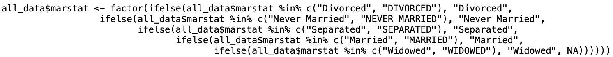

class: inverse, center, middle
```{css webcam-spot, echo = FALSE}
.webcam-wrapper{
  height:0;
  //width: 175px;
  //height: 90px;
  //float: right;
}
```
```{r setup, include=FALSE}
options(htmltools.dir.version = FALSE, width = 93)

knitr::opts_chunk$set(
  # fig.dim = c(4.8, 4.5), 
                      fig.align = "center", 
                      fig.retina = 3, 
                      message = FALSE, 
                      warning = FALSE, 
                      cache = TRUE)

knitr::opts_hooks$set(fig.callout = function(options) {
  if (options$fig.callout) {
    options$echo <- FALSE
    options$out.height <- "99%"
    options$fig.width <- 16
    options$fig.height <- 8
  }
  options
})

# use, where 3 is the link of goals-plot-2 chunk to add:
# .left-code[
#  ```{r goals-plot-2c, fig.show="hide", code=reveal("goals-plot-2", 3)}
# ```
# ]
# .right-plot[
# `)
# ]
reveal <- function(name, num) {
  content <- knitr:::knit_code$get(name)
  last_line <- which(stringr::str_detect(content, "\\+"))[num]
  if (is.na(last_line)) last_line <- length(content)
  if (num == 1) {
    first_line <- 1
    } else {
    first_line <- which(stringr::str_detect(content, "\\+"))[num - 1] + 1
    }
  content[last_line] <- stringr::str_remove(content[last_line], "\\+")
  new_lines <- paste0(content[first_line:last_line], " #<<")
  orig_lines <- if (num == 1) 0 else 1:(first_line - 1)
  c(content[orig_lines], new_lines)
}


# for use when highlighting some parts of code 
# with backticks so that it doesn't run
# include another code block with chunk option 
# code = repeat_code("first-chunk-name")
repeat_code <- function(name) {
  content <- knitr:::knit_code$get(name)
  str_remove_all(content, "`")
}

library(tidyverse)
```

```{r data, include = FALSE}
nlsy <- read_csv(here::here("static", "data", "nlsy.csv")) %>%
  mutate_all(~ifelse(.<= -998 | between(., -6, -1), NA, .)) %>%
  na.omit()

colnames(nlsy) <- c("glasses", "eyesight", "sleep_wkdy", "sleep_wknd",
                    "id", "nsibs", "samp", "race_eth", "sex", "region", 
                    "income", "res_1980", "res_2002", "age_bir")
```

.hand-large[
Let's
]
.larger[
wrangle
]
.hand-large[
our data
]

---
# Making variables in "Base R" 

```{r}
nlsy$region_factor <- factor(nlsy$region)
nlsy$income <- round(nlsy$income)
nlsy$age_bir_cent <- nlsy$age_bir - mean(nlsy$age_bir)
nlsy$index <- 1:nrow(nlsy)
nlsy$slp_wkdy_cat <- ifelse(nlsy$sleep_wkdy < 5, "little",
                              ifelse(nlsy$sleep_wkdy < 7, "some",
                                     ifelse(nlsy$sleep_wkdy < 9, "ideal",
                                            ifelse(nlsy$sleep_wkdy < 12, "lots", NA)
                                            )
                                     )
                            )
```

---
# 💰💲💵💸🤑

### Very quickly your code can get overrun with dollar signs (and parentheses, and arrows)


---
# Prettier way to make new variables: `mutate()`

```{r}
library(tidyverse)
# mutate() is from dplyr
nlsy <- mutate(nlsy, # dataset
               region_factor = factor(region), # new variables
               income = round(income),
               age_bir_cent = age_bir - mean(age_bir),
               index = row_number()
               # could make as many as we want....
               )
```
#### We can refer to variables within the same dataset without the $ notation

---
# `mutate()` tips and tricks

You still need to store your dataset somewhere, so make sure to include the assignment arrow

- Good practice to make new copies with different names as you go along
- R is smart about data storage, so it won't actually copy all of your data (i.e., you won't run out of room with 50 copies of almost identical datasets)
- You can refer immediately to variables you just made:

```{r ref-mut, eval = FALSE}
nlsy_new <- mutate(nlsy,
                   `age_bir_cent` = age_bir - mean(age_bir),
                   age_bir_stand = `age_bir_cent` / sd(`age_bir_cent`)
                   )
```
```{r, code=repeat_code("ref-mut"), echo = FALSE}
```

---

# My favorite R function: `case_when()`

I used to write endless strings of `ifelse()` statements

- If A is TRUE, then B; if not, then if C is true, then D; if not, then if E is true, then F; if not, ...



.center[.go[Are you confused yet?!]]

---
# `case_when()`

```{r}
nlsy <- mutate(nlsy, slp_cat_wkdy = case_when(sleep_wkdy < 5 ~ "little",
                                              sleep_wkdy < 7 ~ "some",
                                              sleep_wkdy < 9 ~ "ideal",
                                              sleep_wkdy < 12 ~ "lots",
                                              TRUE ~ NA_character_ # >= 12
                                              )
               )
# note that table doesn't show NAs! can be dangerous!
table(nlsy$slp_cat_wkdy, nlsy$sleep_wkdy)
```

---
# `case_when()` syntax

- Ask a question (i.e., something that will give `TRUE` or `FALSE`) on the left-hand side of the `~`
  - `sleep_wkdy < 5`
- If `TRUE`, variable will take on value of whatever is on the right-hand side of the `~`
  - `~ "little"`
- Proceeds in order ... if TRUE, takes that value and **stops**
- If you want some default value, you can end with `TRUE ~ {something}`, which every observation will get if everything else is `FALSE`
  - `TRUE ~ NA_character_`
- Must make everything the same type, including missing values (`NA_character_`, `NA_real_` generally)

---
# `case_when()` example

```{r}
nlsy <- mutate(nlsy, total_sleep = case_when(
                                            sleep_wknd > 8 & sleep_wkdy > 8 ~ 1,
                                            sleep_wknd + sleep_wkdy > 15 ~ 2,
                                            sleep_wknd - sleep_wkdy > 3 ~ 3,
                                            TRUE ~ NA_real_
                                             )
               )
```

- Which value would someone with `sleep_wknd = 8` and `sleep_wkdy = 4` go? 
- What about someone with  `sleep_wknd = 11` and `sleep_wkdy = 4`? 
- What about someone with `sleep_wknd = 7` and `sleep_wkdy = 7`?

---
class: inverse

.pull-left[
.huge-number[
1
]
]
.hand-large[
<br>
Your turn...
]
.exercise[
Exercises 3.1: Make some new variables!
]

---
# What about factors?!

Let's look at the variable we made describing someone's weekday sleeping habits:

```{r}
nlsy <- mutate(nlsy, slp_cat_wkdy = case_when(
                                              sleep_wkdy < 5 ~ "little",
                                              sleep_wkdy < 7 ~ "some",
                                              sleep_wkdy < 9 ~ "ideal",
                                              sleep_wkdy < 12 ~ "lots",
                                              TRUE ~ NA_character_
                                              )
               )

summary(nlsy$slp_cat_wkdy)
```

---
# Character variables aren't very helpful in analysis

If the values are the desired labels, it's pretty straightforward: just use `factor()`

```{r new-fact, eval = FALSE}
# I'm just going to replace this variable, instead of making a new one, 
# by giving it the same name a before
nlsy <- mutate(nlsy, slp_cat_wkdy = `factor`(slp_cat_wkdy))
summary(nlsy$slp_cat_wkdy)
```
```{r, code=repeat_code("new-fact"), echo = FALSE}
```
#### Much better, but what's the deal with that order?

---
# `forcats` package

.pull-left-wide[
- Tries to make working with factors safe and convenient
- Functions to make new levels, reorder levels, combine levels, etc.
- All the functions start with `fct_` so they're easy to find using tab-complete!
- Automatically loads with `library(tidyverse)`
]

.pull-right-narrow[

]

---
# Reorder factors

The `fct_relevel()` function allows us just to rewrite the names of the categories out in the order we want them (safely).

```{r fct-relevel, eval = FALSE}
nlsy <- mutate(nlsy, slp_cat_wkdy_ord = `fct_relevel`(slp_cat_wkdy, "little", 
                                                                    "some", 
                                                                    "ideal", 
                                                                    "lots"
                                                    )
               )
```
```{r, code=repeat_code("fct-relevel"), echo = FALSE}
```
```{r}
summary(nlsy$slp_cat_wkdy_ord)
```

---
# What if you misspell something?

```{r misspell, warning = TRUE, eval = FALSE}
nlsy <- mutate(nlsy, slp_cat_wkdy_ord2 = fct_relevel(slp_cat_wkdy, "little", 
                                                                  `"soome"`, 
                                                                   "ideal", 
                                                                   "lots"
                                                     )
               )
```{r, code=repeat_code("misspell"), echo = FALSE, warning = TRUE}
```
```{r}
summary(nlsy$slp_cat_wkdy_ord2)
```

#### You get a warning, and levels you didn't mention are pushed to the end.

---

# Other orders

While amount of sleep has an inherent ordering, region doesn't. Also, the region variable is numeric, not a character!

From the codebook, I know that:
```{r fct-recode, eval = FALSE}
nlsy <- mutate(nlsy, region_fact = factor(region),
                     region_fact = `fct_recode`(region_fact,
                                                        "Northeast" = "1",
                                                        "North Central" = "2",
                                                        "South" = "3",
                                                        "West" = "4"))
summary(nlsy$region_fact)
```
```{r, code=repeat_code("fct-recode"), echo = FALSE}
```

---
# Other orders

So now I can reorder them as I wish -- how about from most people to least?
```{r fct-infreq, eval = FALSE}
nlsy <- mutate(nlsy, region_fact = `fct_infreq`(region_fact))
summary(nlsy$region_fact)
```
```{r, code=repeat_code("fct-infreq"), echo = FALSE}
```
Or the reverse of that?
```{r fct-rev, eval = FALSE}
nlsy <- mutate(nlsy, region_fact = `fct_rev`(region_fact))
summary(nlsy$region_fact)
```
```{r, code=repeat_code("fct-rev"), echo = FALSE}
```

---
# Add levels

Recall that we made it so that the sleep variable had missing values, perhaps because we thought they were outliers:

```{r fct-na, eval = FALSE}
nlsy <- mutate(nlsy, slp_cat_wkdy_out = 
                 `fct_explicit_na`(slp_cat_wkdy, na_level = "outlier"))
summary(nlsy$slp_cat_wkdy_out)
```
```{r, code=repeat_code("fct-na"), echo = FALSE}
```

---
# Remove levels

Or maybe we want to combine some levels that don't have a lot of observations in them:
```{r fct-collapse, eval = FALSE}
nlsy <- mutate(nlsy, slp_cat_wkdy_comb = `fct_collapse`(slp_cat_wkdy, 
                                          "less" = c("little", "some"),
                                          "more" = c("ideal", "lots")
                                                       )
               )
summary(nlsy$slp_cat_wkdy_comb)
```
```{r, code=repeat_code("fct-collapse"), echo = FALSE}
```

---
# Add and remove

Or we can have R choose which ones to combine based on how few observations they have:
```{r fct-lump, eval = FALSE}
nlsy <- mutate(nlsy, slp_cat_wkdy_lump = `fct_lump`(slp_cat_wkdy, n = 2))
summary(nlsy$slp_cat_wkdy_lump)
```

```{r, code=repeat_code("fct-lump"), echo = FALSE}
```

- Probably not a good idea for factors with in inherent order

#### There are 25 `fct_` functions in the package. The sky's the limit when it comes to manipulating your categorical variables in R!

---
class: inverse

.pull-left[
.huge-number[
2
]
]
.hand-large[
<br>
Your turn...
]
.exercise[
Exercises 3.2: Make some new factors!
]


---
# Selecting the variables you want

#### We've made approximately 1000 new variables!

You don't want to keep them all. You'll get confused, and when you go to summarize your data it will take pages.

Luckily there's an easy way to select the variables you want: `select()`!

```{r, eval = FALSE}
nlsy_subs <- `select`(nlsy, id, income, eyesight, sex, region)
nlsy_subs
```
```{r, echo = FALSE}
nlsy_subs <- select(nlsy, id, income, eyesight, sex, region)
print(nlsy_subs, n = 6)
```

---

# `select()` syntax

- Like `mutate()`, the first argument is the dataset you want to select from
- Then you can just list the variables you want!
- Or you can list the variables you *don't* want, preceded by an exclamation point (`!`) or a minus sign (`-`)
- There are also a lot of "helpers"!

```{r neg-sel, eval = FALSE}
select(nlsy_subs, `!`c(id, region))
```
```{r echo = FALSE}
select(nlsy_subs, !c(id, region)) %>% print(n = 5)
```

---
# `all_of()`

Notice that the variable names we used in `select()` weren't in quotation marks.

Let's say you have a list of column names that you want. Then you can use `all_of()` to choose them.

```{r, eval = FALSE}
cols_I_want <- c("age_bir", "nsibs", "region")
select(nlsy, `all_of`(cols_I_want))
```
```{r echo = FALSE}
cols_I_want <- c("age_bir", "nsibs", "region")
select(nlsy, `all_of`(cols_I_want)) %>% print(n = 5)
```

If you don't want an error if they don't exist, use `any_of()`.

---
# Other select helpers

Do you have a lot of variables that are alike in some way? And you want to find all of them? Try:
- `starts_with()`
- `ends_with()`
- `contains()`
- `matches()` (like contains, but for regular expressions)
- `num_range()` (for patterns like `x01`, `x02`, ...)

```{r, eval = FALSE}
select(nlsy, `starts_with`("slp"))
```
```{r, echo = FALSE}
select(nlsy, starts_with("slp")) %>% print(n = 2)
```

---
# Reordering variables

Sometimes you don't want to get rid of the other variables, you just want to move things around. Then use `relocate()`:

Let's move `id` to be the first column:

```{r everything, eval = FALSE}
nlsy <- `relocate`(nlsy, id)
nlsy
```
```{r, echo = FALSE}
nlsy <- relocate(nlsy, id) 
nlsy %>% print(n = 4)
```

---
# Reordering variables

You can relocate multiple variables to the beginning, or specify where they should show up

Let's move `sex` and `region` to be after `id`:

```{r after, eval = FALSE}
relocate(nlsy, sex, region, `.after` = id)
```
```{r, echo = FALSE}
relocate(nlsy, sex, region, .after = id) %>% print(n = 5)
```

---
# Select variables to **do** something to them

This can get a bit confusing (and "best practices" have recently changed), so we won't go into details, but you can put all these tools together:

```{r, eval = FALSE}
nlsy <- mutate(rowwise(nlsy), 
               sleep_avg = mean(c_across(`starts_with`("sleep"))))
select(nlsy, `starts_with`("sleep"))
```
```{r, echo = FALSE}
nlsy <- mutate(rowwise(nlsy), 
               sleep_avg = mean(c_across(starts_with("sleep")))) %>% ungroup()
select(nlsy, starts_with("sleep")) %>%
  print(n = 6)
```
---
# Select variables to **do** something to them

```{r, eval = FALSE}
nlsy <- nlsy %>%
  mutate(across(`starts_with`("sleep"), ~ .x * 60, .names = "{col}_mins"))
select(nlsy, `starts_with`("sleep"))

```

```{r, echo = FALSE}
nlsy <- nlsy %>%
  mutate(across(starts_with("sleep"), ~ .x * 60, .names = "{col}_mins"))
select(nlsy, starts_with("sleep")) %>%
  print(n = 6)
```

---
class: inverse

.pull-left[
.huge-number[
3
]
]
.hand-large[
<br>
Your turn...
]
.exercise[
Exercises 3.3: Create some new datasets!
]


---

# Subsetting data

We usually don't do an analysis in an *entire* dataset. We usually apply some eligibility criteria to find the people who we will analyze. One function we can use to do that in R is `filter()`.

```{r}
wear_glasses <- `filter`(nlsy, glasses == 1)

nrow(wear_glasses)
summary(wear_glasses$glasses)
```

---
# `filter()` syntax

- Like the other functions, we give `filter()` the dataset first, then we give it a series of criteria that we want to subset our data on. 
- As with `case_when()`, these criteria should be questions with `TRUE`/`FALSE` answers. We'll keep all those rows for which the answer is `TRUE`.
- If there are multiple criteria, we can connect them with `&` or just by separating with commas, and we'll get back only the rows that answer `TRUE` to all of them.

```{r}
yesno_glasses <- filter(nlsy, glasses == 0, glasses == 1)
nrow(yesno_glasses)
glasses_great_eyes <- filter(nlsy, glasses == 1, eyesight == 1)
nrow(glasses_great_eyes)
```

---
# Logicals in R

When we used `case_when()`, we got `TRUE`/`FALSE` answers when we asked whether a variable was `>` or `<` some number, for example.

When we want to know if something is

- equal: `==`
- not equal: `!=`
- greater than or equal to: `>=`
- less than or equal to: `<=`

We also can ask about multiple conditions with `&` (and) and `|` (or).

---
# Or statements

To get the extreme values of eyesight (1 and 5), we would do something like:

```{r}
extreme_eyes <- filter(nlsy, eyesight == 1 | eyesight == 5)
table(extreme_eyes$eyesight)
```
We could of course do the same thing with a factor variable:

```{r}
some_regions <- filter(nlsy, region_fact == "Northeast" | region_fact == "South")
table(some_regions$region_fact)
```

---
# Multiple "or" possibilities

Often we have a number of options for one variable that would meet our eligibility criteria. R's special `%in%` function comes in handy here:

```{r}
more_regions <- filter(nlsy, region_fact %in% c("South", "West", "Northeast"))
table(more_regions$region_fact)
```

If the variable's value is any one of those values, it will return `TRUE`.

---
# More `%in%`

This is just a regular R function that works outside of the `filter()` function, of course!

```{r}
7 %in% c(4, 6, 7, 10)
5 %in% c(4, 6, 7, 10)
```

---
# Opposite of `%in%`

We can't say "not in" with the syntax `%!in%` or something like that. We have to put the `!` before the question to basically make it the opposite of what it otherwise would be.

```{r}
!7 %in% c(4, 6, 7, 10)
!5 %in% c(4, 6, 7, 10)
```

```{r}
northcentralers <- filter(nlsy, 
                          !region_fact %in% c("South", "West", "Northeast"))
table(northcentralers$region_fact)
```

---
# Other questions

R offers a number of shortcuts to use when determining whether values meet certain criteria:

- `is.na()`: is it a missing value? 
- `is.finite()` / `is.infinite()`: when you might have infinite values in your data
- `is.factor()`: asks whether some variable is a factor

You can find lots of these if you tab-complete `is.` or `is_` (the latter are tidyverse versions). Most you will never find a use for!

---
# Putting it all together

```{r}
my_data <- filter(nlsy, 
                  age_bir_cent < 1,
                  sex != 1,
                  nsibs %in% c(1, 2, 3),
                  !is.na(slp_cat_wkdy))

summary(select(my_data, age_bir_cent, sex, nsibs, slp_cat_wkdy))
```

---
# Putting it all together

```{r}
oth_dat <- filter(nlsy, 
                  (age_bir_cent < 1) &
                  (sex != 1 | nsibs %in% c(1, 2, 3)) &
                  !is.na(slp_cat_wkdy))

summary(select(oth_dat, age_bir_cent, sex, nsibs, slp_cat_wkdy))
```

---
# Resources

- Here’s an [entire paper ](https://peerj.com/preprints/3163/) about working with factors in R.
- `forcats` [cheat sheet](https://content.cdntwrk.com/files/aT0xMTI0MjU3JnY9MSZpc3N1ZU5hbWU9ZmFjdG9ycyZjbWQ9ZCZzaWc9ZjhhOTkzMTNlZGIxYTQ1ZGM4NTM4OWZiOTVlNzE3YjI%253D)
- Here's [more info](https://tidyselect.r-lib.org/reference/select_helpers.html) on the `select()` helpers
- Here are some [useful functions](https://dplyr.tidyverse.org/reference/mutate.html#useful-mutate-functions) for use with `mutate()`

---
class: inverse

.pull-left[
.huge-number[
4
]
]
.hand-large[
<br>
Your turn...
]
.exercise[
Exercises 3.4: Create some new datasets!
]
