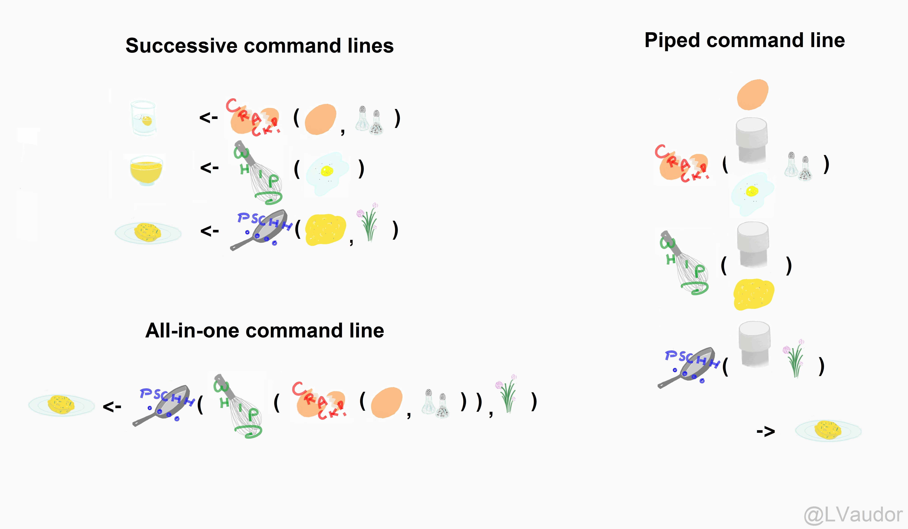

class: inverse, center, middle
```{css webcam-spot, echo = FALSE}
.webcam-wrapper{
  height:0;
  //width: 175px;
  //height: 90px;
  //float: right;
}
```
```{r setup, include=FALSE}
options(htmltools.dir.version = FALSE, width = 93)

knitr::opts_chunk$set(
  # fig.dim = c(4.8, 4.5), 
                      fig.align = "center", 
                      fig.retina = 3, 
                      message = FALSE, 
                      warning = FALSE, 
                      cache = TRUE)

knitr::opts_hooks$set(fig.callout = function(options) {
  if (options$fig.callout) {
    options$echo <- FALSE
    options$out.height <- "99%"
    options$fig.width <- 16
    options$fig.height <- 8
  }
  options
})

# use, where 3 is the link of goals-plot-2 chunk to add:
# .left-code[
#  ```{r goals-plot-2c, fig.show="hide", code=reveal("goals-plot-2", 3)}
# ```
# ]
# .right-plot[
# `)
# ]
reveal <- function(name, num) {
  content <- knitr:::knit_code$get(name)
  last_line <- which(stringr::str_detect(content, "\\+"))[num]
  if (is.na(last_line)) last_line <- length(content)
  if (num == 1) {
    first_line <- 1
    } else {
    first_line <- which(stringr::str_detect(content, "\\+"))[num - 1] + 1
    }
  content[last_line] <- stringr::str_remove(content[last_line], "\\+")
  new_lines <- paste0(content[first_line:last_line], " #<<")
  orig_lines <- if (num == 1) 0 else 1:(first_line - 1)
  c(content[orig_lines], new_lines)
}


# for use when highlighting some parts of code 
# with backticks so that it doesn't run
# include another code block with chunk option 
# code = repeat_code("first-chunk-name")
repeat_code <- function(name) {
  content <- knitr:::knit_code$get(name)
  str_remove_all(content, "`")
}

library(tidyverse)
library(tableone)
```

```{r data, include = FALSE}
nlsy <- read_csv(here::here("static", "data", "nlsy.csv")) %>%
  mutate_all(~ifelse(.<= -998 | between(., -6, -1), NA, .)) %>%
  na.omit()

colnames(nlsy) <- c("glasses", "eyesight", "sleep_wkdy", "sleep_wknd",
                    "id", "nsibs", "samp", "race_eth", "sex", "region", 
                    "income", "res_1980", "res_2002", "age_bir")
```

.hand-large[
Let's
]
.larger[
summarize
]
.hand-large[
our data
]

---
# Last week

### We learned...

- Make a new variable with `mutate()`
--

- Select the variables you want in your dataset with `select()`
--

- Keep only the observations you want in your dataset with `filter()`
--

- We also looked at categorizing our data with factors and the `forcats` package


---
# Your code might start to look like this

```{r, eval = FALSE}
nlsy2 <- mutate(`nlsy`, only = case_when(
                              nsibs == 0 ~ "yes",
                              TRUE ~ "no"))
nlsy3 <- select(`nlsy2`, id, contains("sleep"), only)
only_kids <- filter(`nlsy3`, only == "yes")
only_kids
```
```{r, echo = FALSE}
nlsy2 <- mutate(nlsy, only = case_when(
                                 nsibs == 0 ~ "yes",
                                 TRUE ~ "no"))
nlsy3 <- select(nlsy2, id, contains("sleep"), only)
only_kids <- filter(nlsy3, only == "yes")
print(only_kids, n = 4)
```

---
# Repertoire of functions
.pull-left[
We are doing more and more things to our dataset.

In any data management and/or analysis task, we perform a series of functions to the data until we get some object we want.

Sometimes this can be hard to read/keep track of.


]
.pull-right[.center[

]]
.center[
#### Before we add another set of functions...
]

---
# The pipe
.pull-left[
Certain packages, including `tidyverse`, include a function known as a pipe.

If you have experience with unix programming, you may be familiar with the version of the pipe there: `|`.

R uses this as a pipe: `%>%`
]
.pull-right[.center[


The pipe function is originally from the `magrittr` package, named after [René Magritte](https://en.wikipedia.org/wiki/The_Treachery_of_Images)
]]

---
# We use the pipe to chain together steps
It's like a recipe for our dataset.

```{r, out.width = "75%", echo = FALSE}

```

.footnote[Example from [Lise Vaudor](http://perso.ens-lyon.fr/lise.vaudor/utiliser-des-pipes-pour-enchainer-des-instructions/)]

---
# Instead of successive command lines
```{r}
nlsy2 <- mutate(nlsy, only = case_when(nsibs == 0 ~ "yes", TRUE ~ "no"))
nlsy3 <- select(nlsy2, id, contains("sleep"), only)
only_kids <- filter(nlsy3, only == "yes")
```

# or all-in-one
```{r}
only_kids <- filter(select(mutate(nlsy, only = case_when(nsibs == 0 ~ "yes", 
TRUE ~ "no")), id, contains("sleep"), only), only == "yes")
```

---
# It's like reading a story (or nursery rhyme!)
.pull-left[
```{r, eval = FALSE}
foo_foo <- little_bunny()
bop_on(
  scoop_up(
    hop_through(foo_foo, forest),
    field_mouse),
head)
```
## vs
```{r, eval = FALSE}
foo_foo %>%
  hop_through(forest) %>%
  scoop_up(field_mouse) %>%
  bop_on(head)
```
]
.footnote[Example from [Hadley Wickham](https://t.co/Qn4B7Kna2D?amp=1)
]
.pull-right[

]

---
# A natural order of operations
.pull-left[
```{r, eval = FALSE}
leave_house(
  get_dressed(
    get_out_of_bed(
      wake_up(me))))
```

```{r, eval = FALSE}
me <- wake_up(me)
me <- get_out_of_bed(me)
me <- get_dressed(me)
me <- leave_house(me)
```

```{r, eval = FALSE}
me %>%
  wake_up() %>%
  get_out_of_bed() %>%
  get_dressed() %>%
  leave_house()
```
]
.footnote[Example from [Andrew Heiss](https://twitter.com/andrewheiss/status/1173743447171354624?s=20)]
.pull-left[.middle[.center[
]]]


---
# Using pipes with functions we already know
.pull-left[.midi[
```{r}
nlsy2 <- mutate(nlsy, only = case_when(
  nsibs == 0 ~ "yes",
  TRUE ~ "no"))
nlsy3 <- select(nlsy2, 
   id, contains("sleep"), only)
only_kids <- filter(nlsy3, only == "yes")
only_kids
```
]]
.pull-right[.midi[
```{r pipe1, eval = FALSE}
only_kids <- nlsy `%>%`
  mutate(only = case_when(
    nsibs == 0 ~ "yes",
    TRUE ~ "no")) `%>%`
  select(id, contains("sleep"), only) `%>%`
  filter(only == "yes")
only_kids
```
```{r, code=repeat_code("pipe1"), echo = FALSE}
```
]]

---

# Pipes replace the first argument of the next function

```{r, eval = FALSE}
help(mutate)
help(select)
help(filter)
```
### Usage

`mutate(.data, ...)`

`select(.data, ...)`

`filter(.data, ...)`

---

# Pipes replace the first argument of the next function

.pull-left[
```{r, eval = FALSE}
nlsy2 <- mutate(`nlsy`, only = case_when(
  nsibs == 0 ~ "yes",
  TRUE ~ "no"))
```
]
.pull-right[
```{r, eval = FALSE}
only_kids <- `nlsy` %>%
  mutate(only = case_when(
                nsibs == 0 ~ "yes",
                TRUE ~ "no"))
```
]

---
count:true
# Pipes replace the first argument of the next function

.pull-left[
```{r, eval = FALSE}
nlsy2 <- mutate(nlsy, only = case_when(
  nsibs == 0 ~ "yes",
  TRUE ~ "no"))
nlsy3 <- select(`nlsy2`, 
   id, contains("sleep"), only)
```
]
.pull-right[
```{r, eval = FALSE}
only_kids <- `nlsy %>%`
  `mutate(only = case_when(`
                     `nsibs == 0 ~ "yes",`
                     `TRUE ~ "no"))` %>%
  select(id, contains("sleep"), only)
```
]

---
count:true
# Pipes replace the first argument of the next function

.pull-left[
```{r, eval = FALSE}
nlsy2 <- mutate(nlsy, only = case_when(
  nsibs == 0 ~ "yes",
  TRUE ~ "no"))
nlsy3 <- select(nlsy2, 
   id, contains("sleep"), only)
only_kids <- filter(`nlsy3`, only == "yes")

```
]
.pull-right[
```{r, eval = FALSE}
only_kids <- `nlsy %>%`
  `mutate(only = case_when(`
                     `nsibs == 0 ~ "yes",`
                     `TRUE ~ "no")) %>%`
  `select(id, contains("sleep"), only)` %>%
  filter(only == "yes")
```
]

---
class: inverse

.pull-left[
.huge-number[
1
]
]
.hand-large[
<br>
Your turn...
]
.exercise[
Exercises 4.1: Try out the pipe!!
]

---
# Summary statistics

We have seen that we can get certain summary statistics about our data with the `summary()` function, which we can use either on an entire dataframe/tibble, or on a single variable.

```{r}
summary(only_kids)
summary(nlsy$income)
```

---
# Summary statistics

We can also apply certain functions to a variable(s) to get a single statistic: `mean()`, `median()`, `var()`, `sd()`, `cov`, `cor()`, `min()`, `max()`, `quantile()`, etc.

```{r}
median(nlsy$age_bir)
cor(nlsy$sleep_wkdy, nlsy$sleep_wknd)
quantile(nlsy$income, probs = c(0.1, 0.9))
```

---
# Summary statistics

But what if we want a lot of summary statistics -- just not those that come with the `summary()` function?

- For example, it doesn't give us a standard deviation!

### Introducing `summarize()`

```{r}
summarize(nlsy, 
          med_age_bir = median(age_bir),
          cor_sleep = cor(sleep_wkdy, sleep_wknd),
          ten_pctle_inc = quantile(income, probs = 0.1),
          ninety_pctle_inc = quantile(income, probs = 0.9))
```

---

# `summarize()` specifics

### Usage
`summarize(.data, ...)`

### Arguments

`... Name-value pairs of summary functions. The name will be the name of the variable in the result. The value should be an expression that returns a single value like min(x), n(), or sum(is.na(y)).`

---
# `summarize()` specifics

Important to note:

- Takes a dataframe as its first argument. That means we can use pipes!
- Returns a tibble -- helpful if you want to use those values in a figure or table.
- Can give the summary statistics names.
- Can ask for any type of function of the variables (including one you make up yourself).
  
```{r}
nlsy %>% summarize(q.1 = quantile(age_bir, probs = 0.1),
                   q.2 = quantile(age_bir, probs = 0.2),
                   q.3 = quantile(age_bir, probs = 0.3),
                   q.4 = quantile(age_bir, probs = 0.4),
                   q.5 = quantile(age_bir, probs = 0.5))
```

---
# Update!

Between my making these slides and now, there was a major update to some functions including `summarize()`
- You can now provide functions that return multiple values
- But I am keeping the previous example as something we'll work to improve next week!

```{r}
nlsy %>% summarize(q = quantile(age_bir, 
                                seq(from = .01, to = .05, by = .01)), 
                   quantile = seq(from = .01, to = .05, by = .01))
```
.go[Notice how this output is in rows instead!]

---
# Combining summarize with other functions

Because we can pipe, we can also look at statistics of variables that we make using `mutate()`, in a dataset we've subsetted with `filter()`.

#### All at once!

```{r}
nlsy %>%
  mutate(age_bir_stand = (age_bir - mean(age_bir)) / sd(age_bir)) %>%
  filter(sex == 1) %>%
  summarize(mean_men = mean(age_bir_stand))
```

.center[.go[It's easy to explore your data!]]

---
class: inverse

.pull-left[
.huge-number[
2
]
]
.hand-large[
<br>
Your turn...
]
.exercise[
Exercises 4.2: Calculate some summary statistics.
]

---
# What if we want both groups at once?

```{r}
nlsy %>%
  filter(sex == 1) %>%
  summarize(age_bir_men = mean(age_bir))

nlsy %>%
  filter(sex == 2) %>%
  summarize(age_bir_women = mean(age_bir))
```

---
# We can "group" tibbles using `group_by()`

We can tell it's "grouped" and how many groups there are by printing out the data.

The data itself won't look different, but we'll be able to perform grouped functions on it.

```{r, eval = FALSE}
nlsy_by_region <- group_by(nlsy, region)
nlsy_by_region
```
```{r, echo = FALSE}
nlsy_by_region <- group_by(nlsy, region)
print(nlsy_by_region, n = 8)
```

---
# `group_by()`

Like the other functions we've seen, we can use pipes:

```{r, eval = FALSE}
nlsy %>%
  mutate(income_stand = (income - mean(income))/sd(income)) %>%
  select(id, region, income_stand, race_eth, sex) %>%
  group_by(race_eth)
```

```{r, echo = FALSE}
nlsy %>%
  mutate(income_stand = (income - mean(income))/sd(income)) %>%
  select(id, region, income_stand, race_eth, sex) %>%
  group_by(race_eth) %>%
  print(n = 8)
```

---
# Stratify with `group_by() %>% summarize()`

This function is especially important when calculating summary statistics, which we often want to be stratified.

```{r}
nlsy %>%
  mutate(income_stand = (income - mean(income))/sd(income)) %>%
  group_by(region) %>%
  summarize(mean_inc = mean(income_stand),
            sd_inc = sd(income_stand))
```

---
# Multiple layers of groups
.pull-left[
We can group by multiple variables:

```{r}
nlsy %>%
  group_by(region, sex) %>%
  summarize(mean_inc = mean(income),
            sd_inc = sd(income))
```
]
.pull-right[.large[.go-side[
This would be much easier to read if we had made region and sex into factor variables with labels!
]]]

---
# Counting groups

.pull-left[
Sometimes we just want to know how many observations are in a group. We can do that (at least) three ways!
```{r}
nlsy %>%
  group_by(sex) %>%
  `summarize`(n = n())
```
]
.pull-right[
```{r}
nlsy %>%
  group_by(sex) %>%
  `tally`()
```
```{r}
nlsy %>% 
  `count`(sex)
```
]

---
# Calculating proportions

We can add an extra step to calculate proportions.

1. Group by the variable for which we want proportions
2. Count the number of observations in each group
3. Divide that number by the sum of the counts across all groups

```{r}
nlsy %>%
  group_by(sex) %>%
  summarize(n = n()) %>%
  mutate(prop = n / sum(n))
```

---
class: inverse

.pull-left[
.huge-number[
3
]
]
.hand-large[
<br>
Your turn...
]
.exercise[
Exercises 4.3: Calculate grouped statistics.
]

---
# Making a table 1

Almost every study will involve a Table 1, where you present summary statistics about your sample, often stratified.

There are a number of R packages that can help make your life easier and prevent errors.

### `tableone` package

```{r, eval = FALSE}
install.packages("tableone")
library(tableone)
```
```{r}
tab1 <- CreateTableOne(
  data = nlsy,
  vars = c("eyesight", "nsibs", "race_eth",
    "sex", "region", "income", "age_bir"),
  strata = "glasses",
  factorVars = c("eyesight", "race_eth", "sex", "region")
)
```

---
```{r}
tab1
```

---
# `tableone` options

```{r}
print(tab1, catDigits = 2, contDigits = 2, test = FALSE, smd = TRUE)
```

---
# `tableone` resources

See all the options: 
```{r, eval = FALSE}
help("CreateTableOne")
help("print.TableOne")
```

You can read a walk-through of package options here: https://cran.r-project.org/web/packages/tableone/vignettes/introduction.html


You can see a list of similar packages here: https://github.com/kaz-yos/tableone#similar-or-complementary-projects

---
class: inverse

.pull-left[
.huge-number[
4
]
]
.hand-large[
<br>
Your turn...
]
.exercise[
Exercises 4.4: Try out the Table 1 package!
]
